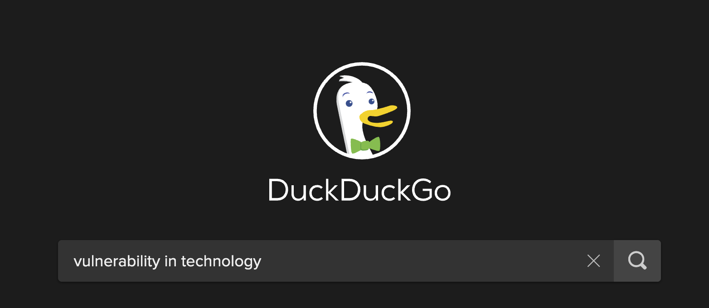

# not yet

### navigating "I don't know"

---

<!-- rare bit of vulnerability -- it is OK to not know! -->

<blockquote class="twitter-tweet" data-align="center" data-width="500">
  
It’s ok to have Imposter Syndrome! You’re not alone. <a href="https://twitter.com/hashtag/programming?src=hash&amp;ref_src=twsrc%5Etfw">#programming</a> <a href="https://twitter.com/hashtag/codetok?src=hash&amp;ref_src=twsrc%5Etfw">#codetok</a> <a href="https://twitter.com/hashtag/CodeNewbies?src=hash&amp;ref_src=twsrc%5Etfw">#CodeNewbies</a> <a href="https://t.co/HUgSWhwdlA">https://t.co/HUgSWhwdlA</a> <a href="https://t.co/lh25J0YGlM">pic.twitter.com/lh25J0YGlM</a>
&mdash; Scott Hanselman (@shanselman) <a href="https://twitter.com/shanselman/status/1348399361521111040?ref_src=twsrc%5Etfw">January 10, 2021</a>
</blockquote>

---
<!-- let's find more examples! -->

---

<!-- nope! -->

---

<!-- what do others say about vulnerability? -->

# Vulnerability
## is **not weakness**, and the uncertainty, risk, and emotional exposure we face every day are **not optional**.
# **Our only choice is a question of engagement**
### - Brene Brown

---

<!-- Brene Brown frequently quotes this 1910 speech -->

# Risk Takers
### at the best: know triumph
### and at the worst: fail while

# **daring greatly**
### - Theodore Roosevelt

---

<!-- related to vulnerability -- growth-based mindset research by Carol Dweck -- resources on Mixer, Marie Potter -->

# Mindset

When you have a **growth mindset** you understand that your abilities can be developed and, therefore, extra time and effort makes you stronger and can result in higher achievement.

 

Opposite of this, a **fixed mindset** is when one believes that their basic qualities, like their intelligence or talent, are simply fixed traits. They spend their time documenting their intelligence or talent instead of developing them. They also believe that talent alone creates success—without effort.

---

---

## I've **missed** more than 9000 shots in my career
## I've **lost** almost 300 games
## 26 times, I've been trusted to take the game winning shot and missed
## I've failed over and over and over again...
# and that is **why I succeed**

### - Michael Jordan

---

# What can we do to shift toward growth-based?

* Be vulnerable
* Take accountability
* Celebrate the process
* Learn from each other
* Share your work

---

---
# References
## Growth-Based Mindset
#### [Mindset: The New Psychology of Success](https://www.goodreads.com/book/show/40745.Mindset)
#### [The Growth Mindset | Carol Dweck | Talks at Google](https://www.youtube.com/watch?v=-71zdXCMU6A)
#### [The Power of Yet](https://www.youtube.com/watch?v=_X0mgOOSpLU)
#### [The Agile Mindset - And Beyond • Linda Rising • GOTO 2012](https://www.youtube.com/watch?v=C13JC_YP2Q8&t=2545s)
#### [The Agile Mindset with Linda Rising](https://hanselminutes.com/389/the-agile-mindset-with-linda-rising)

---
# References (continued)

## Imposter Syndrome
#### [I'm a phony. Are you?](https://www.hanselman.com/blog/im-a-phony-are-you)
#### [Exploring Impostor Syndrome in Technology - SXSW '15](https://www.hanselman.com/blog/exploring-impostor-syndrome-in-technology-sxsw-15)

## "10x"
#### [The mythical 10x programmer](http://antirez.com/news/112)
#### [The “10X Engineer” Has Officially Become a Meme](https://www.7pace.com/blog/10x-engineers)

---

# Deck
on

---

# Questions

