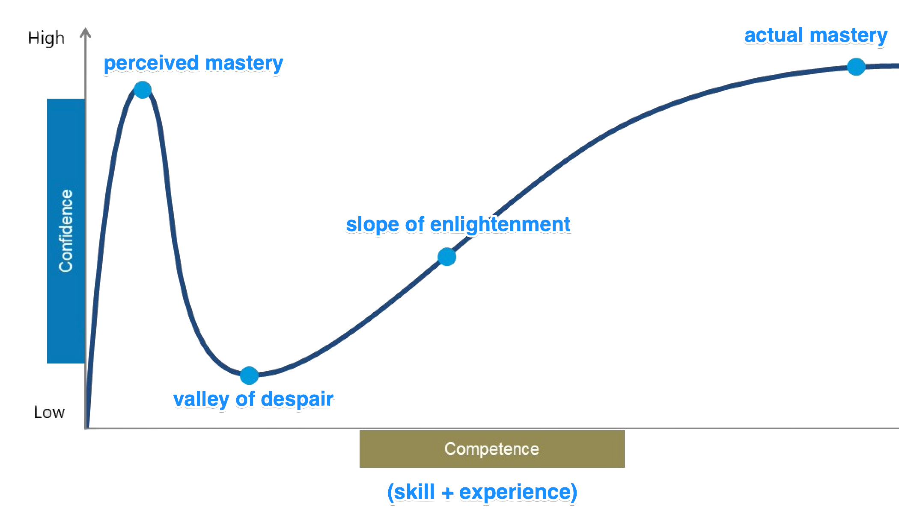
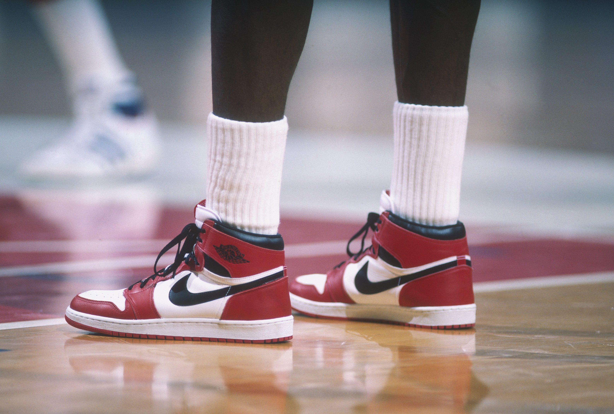

# not yet

### using a growth-based mindset to master technology
* (while combatting
  imposter syndrome)

---

<blockquote class="twitter-tweet" data-align="center" data-width="500">
  
It’s ok to have Imposter Syndrome! You’re not alone. <a href="https://twitter.com/hashtag/programming?src=hash&amp;ref_src=twsrc%5Etfw">#programming</a> <a href="https://twitter.com/hashtag/codetok?src=hash&amp;ref_src=twsrc%5Etfw">#codetok</a> <a href="https://twitter.com/hashtag/CodeNewbies?src=hash&amp;ref_src=twsrc%5Etfw">#CodeNewbies</a> <a href="https://t.co/HUgSWhwdlA">https://t.co/HUgSWhwdlA</a> <a href="https://t.co/lh25J0YGlM">pic.twitter.com/lh25J0YGlM</a>
&mdash; Scott Hanselman (@shanselman) <a href="https://twitter.com/shanselman/status/1348399361521111040?ref_src=twsrc%5Etfw">January 10, 2021</a>
</blockquote>

---

## In order to better understand  **imposter syndrome**,  let's start with its opposite

---

# Dunning-Kruger effect

<!--  social psychologists -->
<!--  Kruger, Justin; Dunning, David (1999). "Unskilled and Unaware of It: How Difficulties in Recognizing One's Own Incompetence Lead to Inflated Self-Assessments" -->

## a cognitive bias in which people **overestimate** their competency

* ### caused by

  * lack of self-awareness
  * insufficient domain knowledge to have an accurate self-assessment
  aka _"you don't know what you don't know"_

---
<!--
_backgroundImage: "linear-gradient(to bottom right, white, white)"
-->

<!-- the hello world/demo app -->

---

# Taking the leap

## Requires

* Courage
* Patience
* Willingness to ~~fail~~ _learn_

---

# Courage

- ### Leaving the comfort of the known for the **unknown**
- ### Being **vulnerable**

---

<!-- let's find more examples! -->

---

<!-- nope!

hard to find content -- same true for other keywords like "fraud"

let's look to the field of cognitive science

-->

---

<!-- related to vulnerability -- growth-based mindset research by Carol Dweck mid-2000s -->
<!-- https://gettyimages.sharepoint.com/sites/cultureanddevelopment/SitePages/GrowthMindset.aspx resources on SharePoint, Marie Potter -->
# Two Mindsets

<fixed>fixed mindset</fixed>: belief that basic qualities, like intelligence or talent, are static attributes. Time is spent documenting intelligence or talent rather than developing capabilities.  Hard work and effort are eschewed as success is determined strictly from inherent ability.

<growth>growth mindset</growth>: belief that abilities can be developed and, therefore, extra time and effort results in increased skill.  Hard work is expected, and when it yields positive results, praised.  Growth-based individuals likely to set more **ambitious** goals than their fixed mindset counterparts.

---
# Patience

## Learning takes **time** <!-- and effort! -->

---

## Learning is **non-linear**

---

## Everyone has a **unique journey**

<!-- every moment is a snapshot in time of that journey -->

---

# Willingness to ~~fail~~ learn

Skill acquisition (particularly in technology) is often trial-and-error.

* Types of error feedback
  * linter / compiler
  * experimentation
  * code review
  * testing
  * bugs

---

# Independent learning

* IntelliSense
* refactoring suggestions
* `Ctrl + Z` <!-- good for exploring alternate syntax -->
* interactive debugging
* `git reset --hard`
* `git reset HEAD~1`
* `git push --delete origin my-branch`
* programming books <!-- my favorite: The Pragmatic Programmer by David Thomas, Andrew Hunt-->
* rubber duck

---

# Organizational learning

* Mentorship
* Share your work <!-- not just code! -->
* Pair programming

---

# Community learning

* Open source
* Meetup groups
* Conferences / workshops

---

## Destigmatizing "failure"

<!--
_backgroundImage: "linear-gradient(to bottom right, black, black)"
-->

### “I haven’t failed, I have just found  10000 ways that won’t work”
###### - Thomas Edison

---

<!--
_backgroundImage: "linear-gradient(to bottom right, black, black)"
-->

<!-- Brene Brown frequently quotes this 1910 speech -->

## Accepting Challenges
### at the best:
#### you'll know triumph
### and at the worst:
#### fail while

## **daring greatly**
###### - Theodore Roosevelt

---

<!--
_backgroundImage: "linear-gradient(to bottom right, black, black)"
-->

## I've **missed** more than 9000 shots in my career
## I've **lost** almost 300 games
## 26 times, I've been trusted to take the game winning shot and missed
## I've failed over and over and over again...
## and that is **why I succeed**

###### - Michael Jordan

---
# Wrapping Up

Why was the talk called "not yet"?
### not
* ##### vulnerability
  * admitting you don't know
  * sharing your journey
### yet
* #### accountability
  * accepting challenges
  * commitment (to yourself and others)
---
# References
## Growth-Based Mindset
- #### [Mindset: The New Psychology of Success](https://www.goodreads.com/book/show/40745.Mindset)
- #### [The Growth Mindset | Carol Dweck | Talks at Google](https://www.youtube.com/watch?v=-71zdXCMU6A)
- #### [The Power of Yet](https://www.youtube.com/watch?v=_X0mgOOSpLU)
- #### [Growth Mindset vs. Fixed](https://positivepsychology.com/growth-mindset-vs-fixed-mindset/)
- #### [The Agile Mindset - And Beyond • Linda Rising • GOTO 2012](https://www.youtube.com/watch?v=C13JC_YP2Q8&t=2545s)
- #### [The Agile Mindset with Linda Rising](https://hanselminutes.com/389/the-agile-mindset-with-linda-rising)

---
# References (continued)

## Imposter Syndrome
- #### [I'm a phony. Are you?](https://www.hanselman.com/blog/im-a-phony-are-you)
- #### [Dunning-Kruger Effect](https://www.psychologytoday.com/us/basics/dunning-kruger-effect)
- #### [Exploring Impostor Syndrome in Technology - SXSW '15](https://www.hanselman.com/blog/exploring-impostor-syndrome-in-technology-sxsw-15)

---

# Deck
on

---

# Questions

